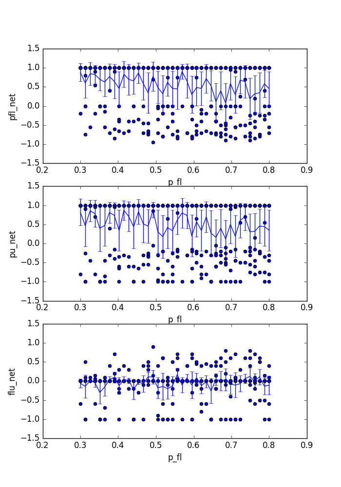
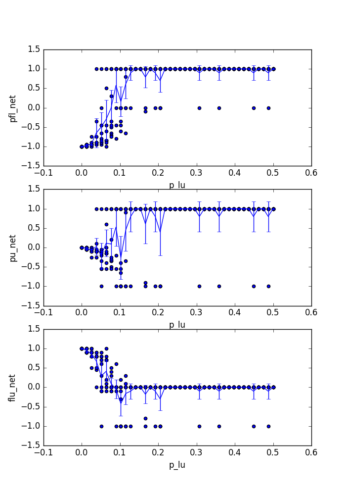

default_params = [0.55789815, 0.24274519, 0.67746897, 0.5692026, 0.09658372, 2.01339576]

ranges = [np.linspace(0.4, 0.7, 40), np.linspace(0, 0.7, 40), np.linspace(0.3, 0.9, 40),
          np.linspace(0.3, 0.8, 40), np.linspace(0, 0.5, 40), np.floor(np.linspace(1, 20, 40))]

param_names = ['p_uf', 'p_pu', 'p_up', 'p_fl', 'p_lu', 'g']

role_division={Unassigned: 10, Follower: 0, Leader: 5, Pheromone: 5}

max_iter = 500

replicates = 10

